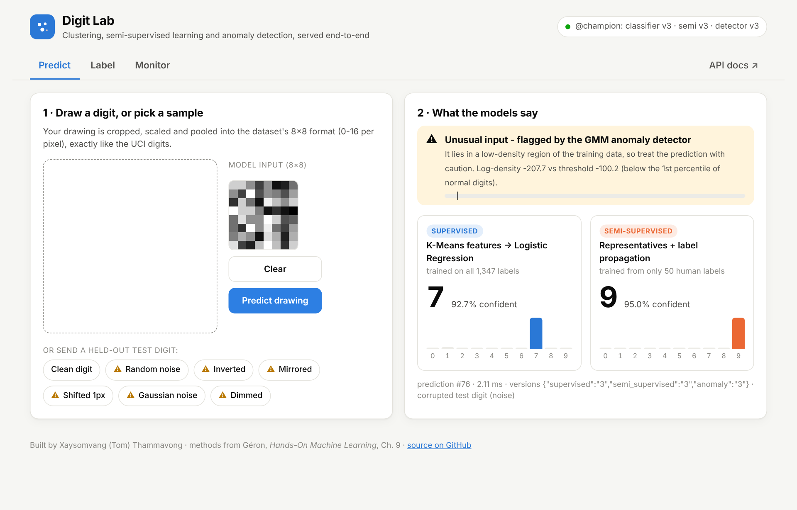
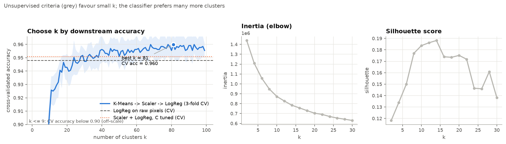
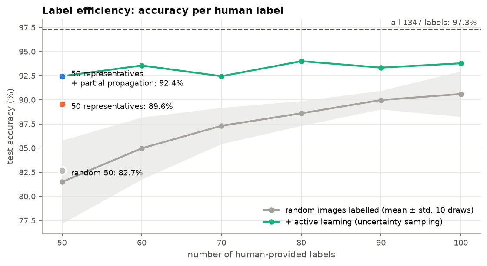
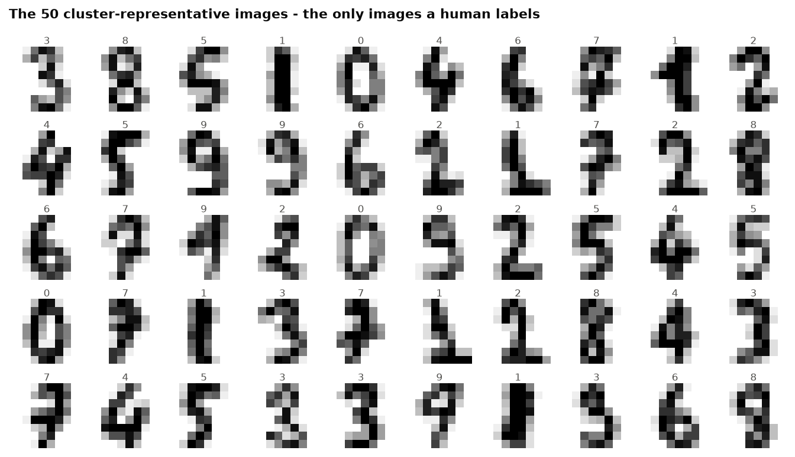
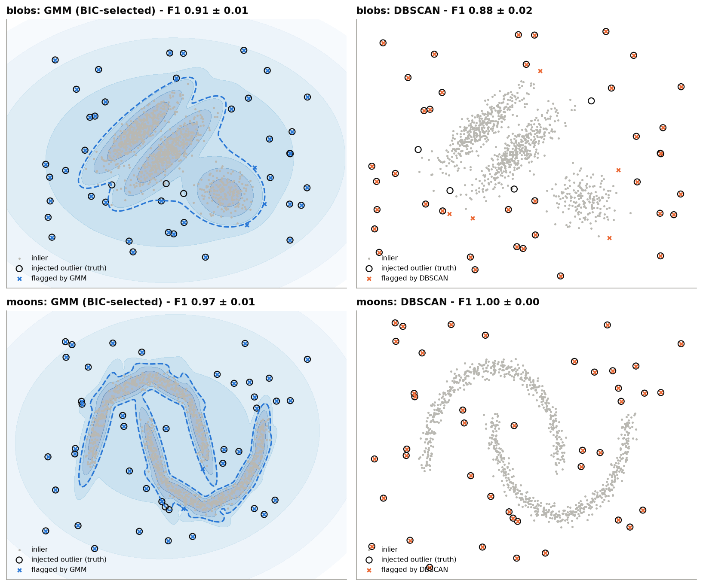
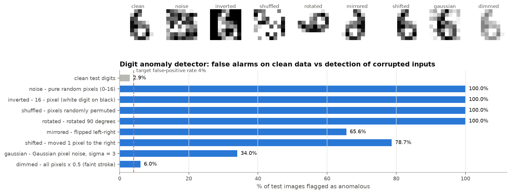
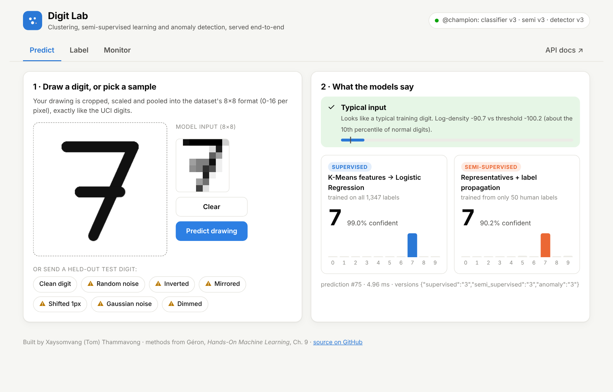
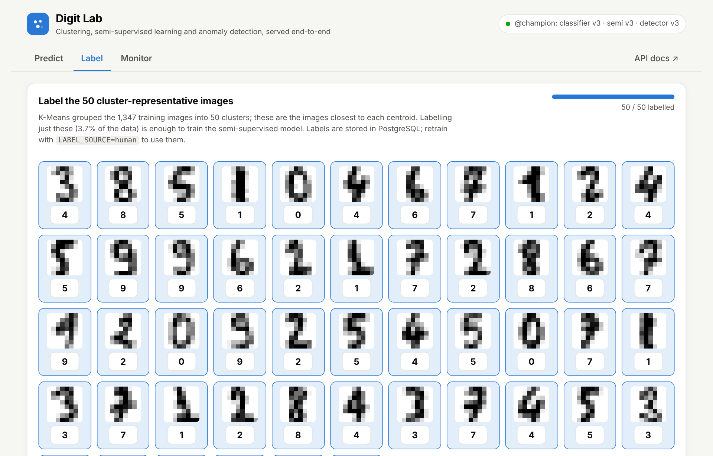
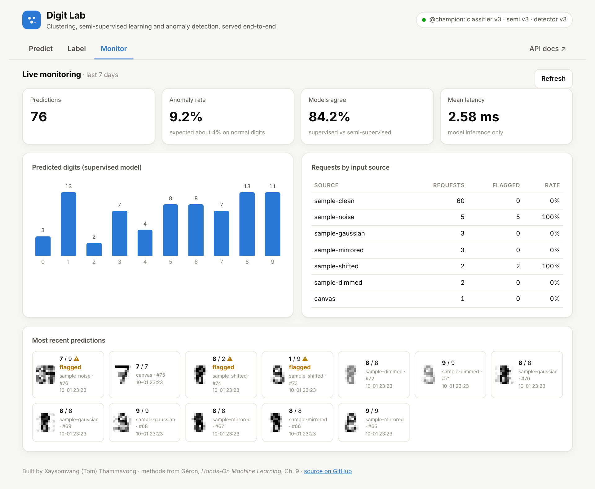
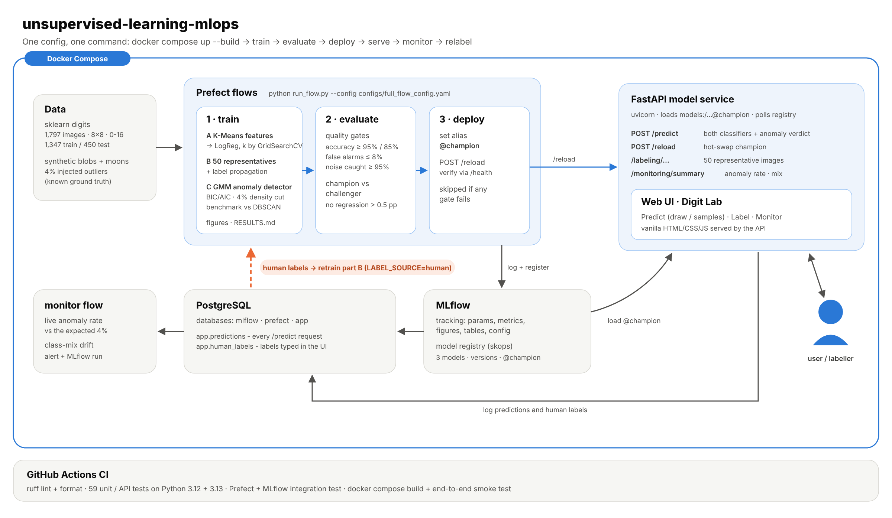

<h1 align="center">Unsupervised Learning MLOps</h1>

<p align="center"><b>Clustering, semi-supervised learning and anomaly detection, from notebook to monitored service, with one config and one command.</b></p>

<p align="center">
  <a href="https://github.com/ToMooGo/unsupervised-learning-mlops/actions/workflows/ci.yml"></a>
  
  
  
  
  
</p>

<p align="center"></p>
<p align="center"><sub>Pure random noise (<code>/samples?kind=noise&amp;seed=32</code>): the classifiers answer "7" (92.7% confident) and "9" (95.0%). <b>The Gaussian-mixture anomaly detector flags it.</b> Across 40 noise inputs the classifier averages 65% confidence, and the detector flags all 40.</sub></p>

**In one sentence:** you label only 50 images and still get a 92% accurate classifier. A second model warns you when an input doesn't look like anything it was trained on. The whole thing runs as a small production system with one command.

> **What:** an end-to-end portfolio project on the scikit-learn *digits* dataset (1,797 handwritten digits, 8×8 pixels). It reproduces and extends the unsupervised-learning methods of Géron, *Hands-On Machine Learning* (2nd ed.), Chapter 9.
> **Why:** labelling is the expensive part of machine learning. Clustering can cut the labels needed, improve features and flag untrustworthy inputs.
> **Skills shown:** clustering (K-Means, DBSCAN), Gaussian mixtures and the EM algorithm, BIC/AIC, semi-supervised and active learning, anomaly detection, PCA, honest evaluation (multi-split, tuned baselines, ablations). On the engineering side: Prefect, MLflow model registry, FastAPI, PostgreSQL, Docker Compose, pytest, GitHub Actions.

| | Question | Method | Result (held-out test set) |
|---|---|---|---|
| **A** | Can clustering improve a classifier? | K-Means distances as features for Logistic Regression, *k* tuned by `GridSearchCV` | **96.9%** mean accuracy over 5 random splits: **+0.6 pp** over a tuned, scaled baseline (96.3%) and +1.3 pp over the book's baseline (95.6%) |
| **B** | How few labels can we get away with? | Label only the **50 cluster-representative** images (3.7% of the data), then propagate labels to the closest 20% of each cluster | **82.7% → 92.4%** vs. 50 random labels; propagated labels **98.3%** correct |
| **C** | Can we flag inputs the model shouldn't trust? | Gaussian Mixture density with BIC model selection and a held-out 4th-percentile threshold, benchmarked against DBSCAN | Best detector on elliptical clusters (F1 **0.91** vs DBSCAN 0.88); DBSCAN wins on curved ones (1.00 vs 0.97). On digits it catches **100%** of noise, inverted, shuffled and rotated inputs (73% across all 8 corruption types) at a **2.9%** false-alarm rate |

Everything (training, experiment tracking, quality gates, deployment, the web app, prediction logging, drift monitoring and human-in-the-loop relabelling) runs locally with **`docker compose up --build`**. No cloud account is needed.

> Numbers in this README come from [`reports/RESULTS.md`](reports/RESULTS.md), which the pipeline regenerates on every run, and from the executed [notebooks](notebooks/). The mathematics (K-Means, EM, BIC/AIC, threshold calibration) is derived in the [technical report (PDF)](reports/technical_report/technical_report.pdf).

---

## Table of contents
- [Results](#results)
- [Demo](#demo)
- [Architecture](#architecture)
- [Tools / technologies](#tools--technologies)
- [Quick start](#quick-start)
- [How everything works together](#how-everything-works-together)
- [Human-in-the-loop labelling](#human-in-the-loop-labelling)
- [Adopted practices](#adopted-practices)
- [Repository structure](#repository-structure)
- [Testing and CI](#testing-and-ci)
- [Limitations and next steps](#limitations-and-next-steps)

---

## Results

### A. K-Means as a feature-engineering step
Each 8×8 image is replaced by its distances to *k* centroids, and Logistic Regression is trained on those distances. *k* is a hyperparameter of the **classifier**, so it is chosen by 3-fold CV accuracy rather than by inertia or silhouette score.

| Model | Split `random_state=42` | Mean ± std, 5 other splits |
|---|---|---|
| Logistic Regression on raw pixels (book baseline) | 97.3% | 95.6% ± 1.0% |
| StandardScaler → Logistic Regression, C tuned by CV (strong baseline) | 97.1% | 96.3% ± 1.2% |
| **K-Means → StandardScaler → Logistic Regression**, k tuned (k = 81 on split 42) | **97.6%** | **96.9% ± 0.9%** |



**How to read this honestly:**
* One 450-image test set is noisy. One image is 0.22 pp, and on split 42 the whole difference is 12 → 11 errors.
* The multi-split numbers are the evidence. *k* (grid 10, 20, …, 90) and *C* are re-tuned inside every split on training data only.
* The K-Means pipeline beats the strong baseline on 4/5 splits, by **+0.6 pp** on average. The gain is real but modest.
* The `StandardScaler` on the distance features is an engineering fix. Raw distances share a large offset: the condition number of the feature Gram matrix is 2.2·10⁸ raw versus 4.7·10³ scaled. With the scaler, `lbfgs` converges in 44 iterations instead of 1,268, and the grid search is about 6× faster (ablation in `RESULTS.md`).

### B. Semi-supervised learning: 50 labels instead of 1,347
| Training labels | Test accuracy | Label accuracy |
|---|---|---|
| 50 random images | 82.7% | 100% |
| 50 cluster representatives | 89.6% | 100% |
| + propagate to the whole cluster (1,347 images) | 90.9% | 93.5% |
| **+ propagate to the closest 20% (288 images)** | **92.4%** | **98.3%** |
| all 1,347 true labels (upper bound) | 97.3% | 100% |

Over 5 random splits: **83.4% ± 2.5% → 92.4% ± 1.0%**. The 20% propagation percentile is the book's choice; the sweep in the notebook is not monotone. Uncertainty-sampling **active learning** with 50 more labels reached 93.8% in a single run, about 6 test images better. Treat that as indicative.

 

**Label quality matters more here than in ordinary supervised learning.** Each representative label is copied to its whole neighbourhood, so one wrong label costs about **2.4 pp** of accuracy on average ([notebook 02](notebooks/02_semi_supervised_learning.ipynb)). The pipeline's champion-vs-challenger gate blocks such regressions (see [below](#human-in-the-loop-labelling)).

### C. Anomaly detection
**C1. GMM vs DBSCAN on data with known outliers.** The book's examples have no ground truth, so 4% outliers are injected into the book's blob and moon datasets. Each benchmark is repeated on 5 random datasets. Every detector gets the same prior, the expected 4% contamination. DBSCAN's `eps` is calibrated without labels so that its noise fraction matches that prior.

| F1 (mean ± std, 5 datasets) | blobs (elliptical clusters) | moons (curved clusters) |
|---|---|---|
| **GMM**, k and covariance type by BIC | **0.914 ± 0.013** | 0.971 ± 0.011 |
| **DBSCAN**, eps calibrated without labels | 0.884 ± 0.024 | **1.000 ± 0.000** |
| Local Outlier Factor (reference) | 0.857 ± 0.048 | 1.000 ± 0.000 |
| Isolation Forest (reference) | 0.819 ± 0.071 | 0.810 ± 0.053 |
| Elliptic Envelope / Fast-MCD (reference) | 0.667 ± 0.081 | 0.652 ± 0.055 |



The GMM wins when its Gaussian assumption holds; the blobs are Gaussian by construction, which favours it. DBSCAN wins on arbitrary shapes. Fast-MCD assumes a *single* Gaussian, so it fails on both datasets.

**C2. The detector that ships with the API.** PCA keeps 95% of the variance (28 dimensions), then a GMM with k = 6 and full covariance is selected by BIC. The threshold is the 4th percentile of **held-out** densities.



* Calibrating the threshold on held-out data matters. The book's approach, the 4th percentile of *training* densities, flags **8.9%** of clean test digits instead of the intended 4%. The held-out threshold flags **2.9%**.
* The flag carries information about the classifier. On clean test digits, the classifier's error rate is 30.8% on flagged images (4 of 13) against 1.6% on the rest (7 of 437). The sample is small.
* **The detector has blind spots, and they are reported.** It misses most *dimmed* digits (6% caught) and many mildly noisy ones (34%). Across all eight corruption types it catches 73%.

Full tables, ablations and per-seed results are in [`reports/RESULTS.md`](reports/RESULTS.md) and [`reports/metrics.json`](reports/metrics.json).

---

## Demo
| Predict (draw or pick a sample) | Label the 50 representatives | Monitor live traffic |
|---|---|---|
|  |  |  |

* **Predict.** Draw a digit (it is cropped, scaled and pooled to the dataset's 8×8 format) or send a held-out test digit, optionally corrupted. Both classifiers answer, and the anomaly detector says whether to trust them.
* **Label.** The 50 images K-Means chose for a human to label. Labels are stored in PostgreSQL and used by the next training run.
* **Monitor.** Request volume, live anomaly rate vs. the expected 4%, model agreement, the predicted-digit mix and recent requests. The screenshot shows *demo traffic*. Deliberately corrupted samples were mixed in, which is why the anomaly rate (9.2%) sits above the 4% expected for normal digits. The monitor flow alerts above 12%.
* Interactive API documentation is at `http://localhost:8000/docs`.

---

## Architecture


## Tools / technologies
- **Platform:** Docker Compose (5 services)
- **ML:** scikit-learn (K-Means, Logistic Regression, Gaussian Mixture, DBSCAN, PCA, GridSearchCV), NumPy, pandas, Matplotlib
- **Pipeline orchestration:** Prefect 3 (server + flows/tasks with retries)
- **Experiment tracking and model registry:** MLflow 3 (PostgreSQL backend, proxied artifact store, `@champion` aliases, `skops` serialisation)
- **Serving:** FastAPI + Uvicorn, with a vanilla HTML/CSS/JS front-end served by the API
- **Database:** PostgreSQL 16 (MLflow, Prefect and app databases; SQLAlchemy 2 ORM)
- **Quality:** pytest (59 unit/API tests + an integration test), ruff, GitHub Actions on Python 3.12 and 3.13 (including a Docker Compose end-to-end smoke test)

## Quick start
**Requirements:** Docker with Docker Compose v2.

```bash
git clone https://github.com/ToMooGo/unsupervised-learning-mlops.git
cd unsupervised-learning-mlops
docker compose up --build            # full experiment, about 5 min after the image build
# or: FLOW_CONFIG=configs/quick_flow_config.yaml docker compose up --build   (about 1 min)
# Linux: `make up` passes your user id, so the files written to ./reports belong to you
```
When the `pipeline` container logs `Full flow finished`, open:

| Service | URL |
|---|---|
| Web UI (Digit Lab) | http://localhost:8000 |
| API docs (Swagger) | http://localhost:8000/docs |
| MLflow (experiments + registry) | http://localhost:5050 |
| Prefect (flow runs) | http://localhost:4200 |
| PostgreSQL | localhost:5432 (user/password `mlops`) |

Ports and credentials can be changed in `.env` (see `.env.example`).

> **Security note.** This is a local demo stack. Ports are bound to `127.0.0.1` and the default database credentials are for local use only. `POST /reload` can be protected with `ADMIN_TOKEN`. The labelling endpoint is open, so don't expose the stack to the internet as-is.

**Without Docker** (Python 3.12+):
```bash
make install          # pip install -r requirements-dev.txt && pip install -e .
make test             # 59 tests in about 15 s
make quick            # train -> evaluate -> deploy, local SQLite MLflow, about 1 min
make api              # UI + API on http://localhost:8000
```

## How everything works together
`python run_flow.py --config configs/full_flow_config.yaml` runs three Prefect sub-flows in sequence. The `flow:` key in the config (or `--flow`) selects `full | train | eval | deploy | monitor`.

1. **Train flow** (`flows/train_flow.py`). One parent MLflow run with a nested run per part:
   1. Load digits and split 1,347/450 (`seed: 42`).
   2. **Part A:** baseline → K-Means(50) pipeline → `GridSearchCV` over k = 2…99 → 5-split robustness check → scaling ablation.
   3. **Part B:** representatives → labels from the oracle, or from PostgreSQL when `LABEL_SOURCE=human` → full / partial propagation → percentile sweep → active learning → robustness.
   4. **Part C:** synthetic benchmark (5 seeds × 2 datasets × 5 detectors) → digits GMM selected by BIC → held-out threshold → corruption test.
   5. Log params, metrics, tables and figures. **Register** the three models (`digits-kmeans-logreg`, `digits-semi-supervised`, `digits-gmm-anomaly`) in the MLflow registry.
   6. Write `reports/figures/*.png`, `reports/metrics.json` and `reports/RESULTS.md`.
2. **Evaluation flow** (`flows/eval_flow.py`). Reload the *registered* models and score them on the test set. **Quality gates:** supervised ≥ 95%, semi-supervised ≥ 85%, anomaly false alarms ≤ 8%, noise/inverted/shuffled detection ≥ 95%. **Champion vs. challenger:** the candidate may not be more than 0.5 pp worse than the current `@champion`.
3. **Deploy flow** (`flows/deploy_flow.py`). Only if every gate passes: move the `@champion` alias, `POST /reload` the API, and confirm the served versions through `/health`. API replicas also poll the registry, so every worker picks up a new champion.
4. **Serving.** Every `/predict` is logged to `app.predictions` (input, both predictions, log-density, verdict, model versions, latency).
5. **Monitor flow** (`configs/monitor_flow_config.yaml`). Reads the prediction log and raises an alert when the live anomaly rate exceeds 3× the expected 4% or one digit dominates the traffic. Each check is logged as an MLflow run. To run it hourly as a Prefect deployment: `docker compose --profile monitor up -d monitor`.

## Human-in-the-loop labelling
```bash
# 1. open http://localhost:8000 -> Label, type the 50 digits, Save
# 2. retrain part B from your labels (other parts are unchanged)
LABEL_SOURCE=human docker compose run --rm pipeline
```
This loop was tested end to end with one deliberate labelling mistake out of 50:

1. The UI reported 49/50 agreement with the dataset's labels.
2. The retrained semi-supervised model dropped from 92.4% to 88.9%.
3. The evaluation flow failed the **champion-vs-challenger** check and **did not deploy it**, so the service kept serving the better model.

The same incident is reproduced in [notebook 02](notebooks/02_semi_supervised_learning.ipynb) and in the unit test `test_champion_blocks_a_regression_from_one_wrong_label`.

## Adopted practices
- **One config, one command.** A single YAML drives every flow, with `${ENV:default}` placeholders so the same file works on a laptop and in Docker.
- **Honest evaluation.** Hyperparameters are tuned on training data only. The comparison includes a tuned, scaled baseline as well as the book's. Results are reported as multi-split / multi-seed mean ± std, ablations are included, and blind spots are documented.
- **Reproducibility.** Seeds are fixed everywhere, Docker images are pinned to exact versions, and reports are regenerated by the pipeline rather than edited by hand.
- **Model registry with aliases** (`@champion`), skops serialisation with an explicit trusted-type list instead of pickle, and hot reload without downtime.
- **Quality gates and champion/challenger** before any deployment.
- **Prediction logging** to PostgreSQL, with a monitoring flow and dashboard.
- **Typed, defensive API**: Pydantic validation (exactly 64 finite pixels in 0–16, safe text fields), escaped HTML in the UI, an optional admin token on `/reload`, a health check and a non-root API container.
- **Logging** with the `logging` module, not `print`. Code is formatted and linted with ruff.

## Repository structure
```
├── configs/               full / quick / monitor flow configs (YAML)
├── flows/                 Prefect flows: train, eval, deploy, full, monitor (+ scheduled serve)
├── src/unsupervised_mlops/
│   ├── data.py            digits split, synthetic data + injected outliers, corruptions
│   ├── clustering_features.py   Part A
│   ├── semi_supervised.py       Part B
│   ├── anomaly.py               Part C (GMM / DBSCAN detectors, BIC/AIC, benchmark)
│   ├── gates.py           quality gates + champion/challenger rule
│   ├── monitoring.py      drift checks on the prediction log
│   ├── tracking.py        MLflow + registry helpers
│   ├── db.py              SQLAlchemy schema shared by API and flows
│   ├── plots.py, reporting.py
├── services/
│   ├── api/               FastAPI app + web UI (static/), Dockerfile
│   ├── pipeline/          training image
│   ├── mlflow/            tracking server image
│   └── postgres/init.sql
├── notebooks/             01 clustering features · 02 semi-supervised · 03 anomaly detection
├── reports/               RESULTS.md, metrics.json, figures/, technical_report/ (LaTeX + PDF)
├── tests/                 unit, API and integration tests
├── docker-compose.yml · run_flow.py · Makefile · pyproject.toml
```

## Testing and CI
```bash
make test        # 59 unit + API tests (in-memory models, temporary SQLite DB)
make test-all    # + integration test: the quick config end-to-end through Prefect and MLflow
```
GitHub Actions runs ruff (lint and format), the unit/API tests and the integration test. It then builds the Docker images, starts the stack, trains and deploys with the quick config, and smoke-tests `/health` and `/predict`.

## Limitations and next steps
- **Small data.** The digits dataset has 1,797 images at 8×8 resolution. The methods transfer to real unlabelled data (images, sensor data, transactions), but the absolute numbers will not.
- **Synthetic anomalies.** Real anomalies are rarely as clean as injected outliers or the corruption types used here. Precision and recall would need re-measuring on labelled incidents.
- **Detector blind spots** (dimmed strokes, mild noise). Pairing the GMM with a PCA reconstruction-error score is a natural next step.
- **Active learning** is simulated with the oracle. Serving its queries on the Label page would close that loop with a real person too.
- **One test set does double duty.** The deployment gates and the reported results both use the same 450 test images. A separate validation split for gating would be cleaner on a larger dataset.
- **On-prem to cloud.** Every service is a container, so the same compose file maps onto a managed Postgres, an object store for MLflow artifacts and a container service for the API.

---

**Author:** Xaysomvang (Tom) Thammavong · Data Scientist · [LinkedIn](https://www.linkedin.com/in/xaysomvang-thammavong-63189a1b9/) · [GitHub @ToMooGo](https://github.com/ToMooGo)  
**Reference:** A. Géron, *Hands-On Machine Learning with Scikit-Learn, Keras & TensorFlow*, 2nd ed., O'Reilly, 2019, Ch. 8–9.  
**Inspired by** the structure of [full-stack-on-prem-cv-mlops](https://github.com/jomariya23156/full-stack-on-prem-cv-mlops).
